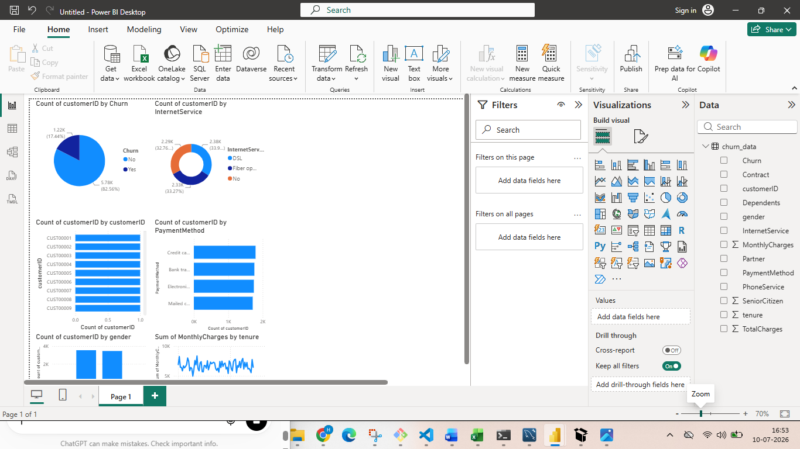
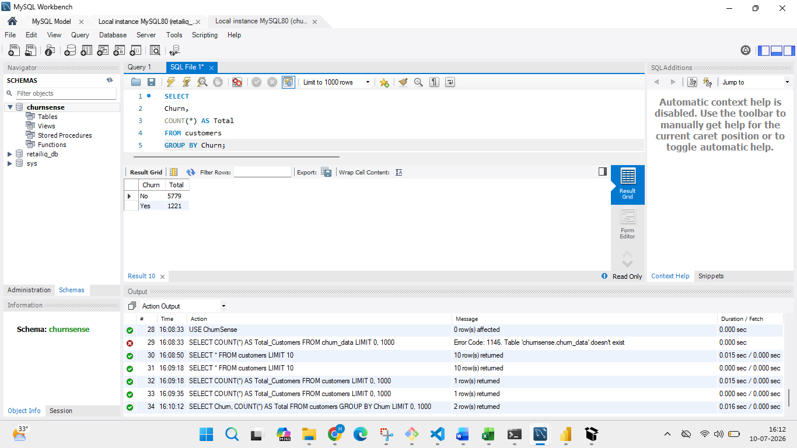
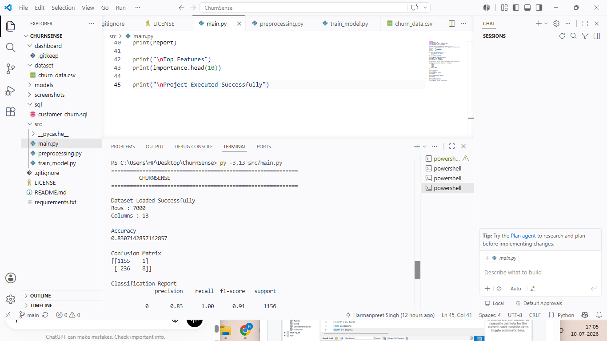
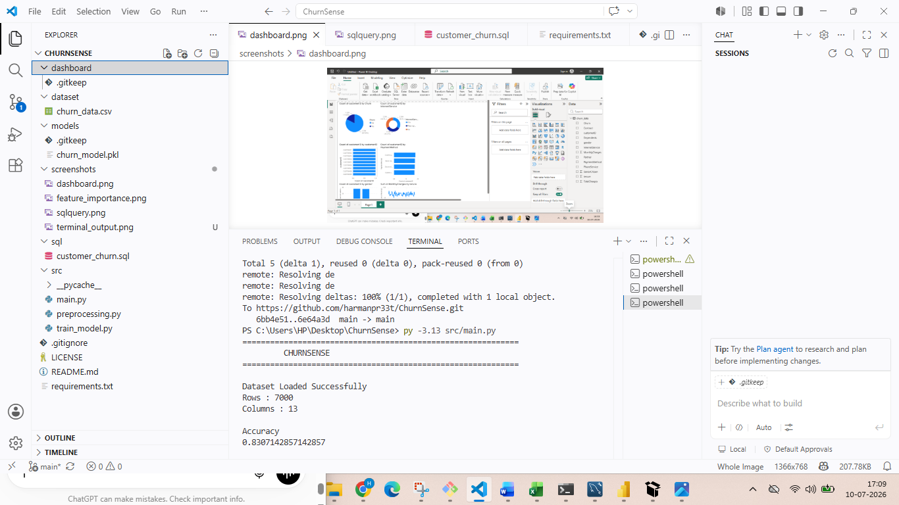

# 🚀 ChurnSense

## Customer Churn Analytics & Prediction

An end-to-end Data Analytics project that analyzes customer churn using **Python, SQL, Power BI, and Logistic Regression**.

---

## 📌 Project Overview

Customer churn is a major business challenge for subscription-based companies. This project performs customer churn analysis using SQL, visualizes insights with Power BI, and predicts churn using a Logistic Regression model in Python.

---

## ✨ Features

- Data Cleaning & Preprocessing
- SQL Business Analysis
- Power BI Dashboard
- Customer Churn Prediction
- Logistic Regression Model
- Business Insights

---

## 🛠 Tech Stack

- Python
- Pandas
- NumPy
- Matplotlib
- Scikit-Learn
- MySQL
- Power BI
- Git & GitHub

---

## 📂 Project Structure

```
ChurnSense
│
├── dataset/
├── dashboard/
├── models/
├── screenshots/
├── sql/
├── src/
├── README.md
├── requirements.txt
├── LICENSE
└── .gitignore
```

---

## 🤖 Machine Learning

Algorithm Used:

- Logistic Regression

---

## 📊 SQL Analysis

The project includes SQL analysis for:

- Total Customers
- Customer Churn
- Churn Rate
- Contract Analysis
- Gender Analysis
- Internet Service Analysis
- Payment Method Analysis

---

## 📈 Power BI Dashboard

Dashboard includes:

- Customer Distribution
- Churn Analysis
- Contract Analysis
- Gender Analysis
- Internet Service Analysis
- Payment Method Analysis

---

# 📸 Screenshots

## Power BI Dashboard



---

## SQL Analysis



---

## Terminal Output



---

## Project Structure



---

## 🚀 Installation

```bash
git clone https://github.com/harmanpr33t/ChurnSense.git

cd ChurnSense

pip install -r requirements.txt

python src/main.py
```

---

## 💼 Business Insights

- Month-to-month customers show higher churn.
- Contract type influences customer retention.
- Internet service impacts churn behavior.
- Customer segmentation helps improve retention strategies.

---

## 🔮 Future Improvements

- Random Forest
- XGBoost
- Streamlit Deployment
- Advanced Power BI Dashboard

---

## 👨‍💻 Author

**Harmanpreet Singh**

GitHub:
https://github.com/harmanpr33t

---

⭐ If you found this project useful, don't forget to star the repository.